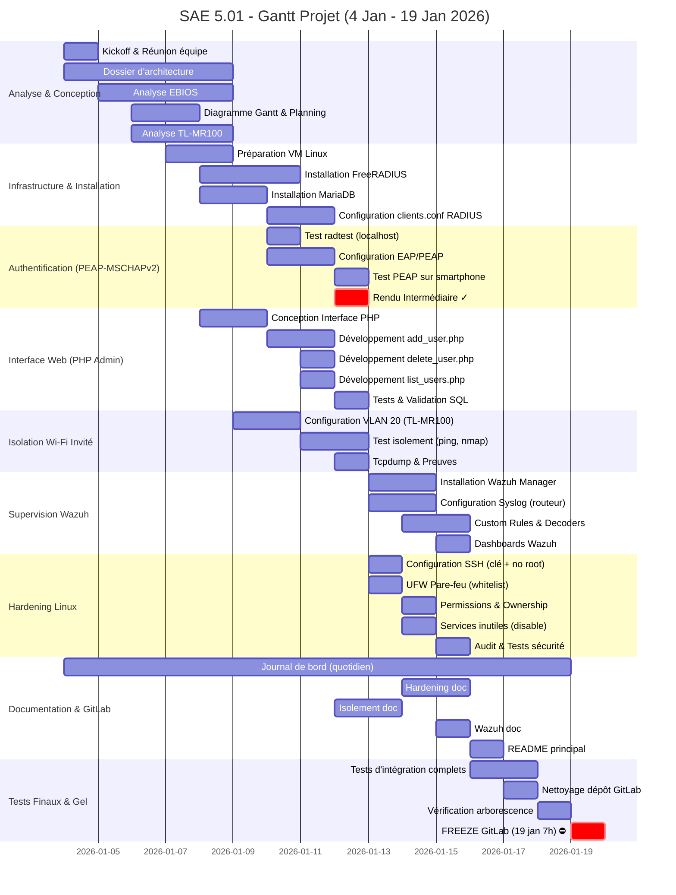
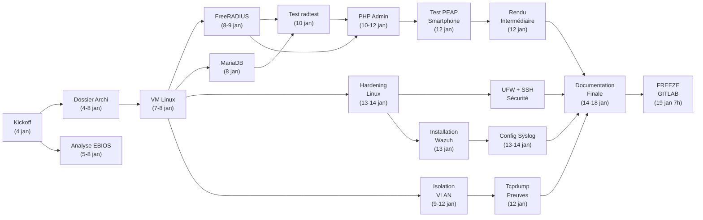

# Diagramme de Gantt - Planning Projet SAE 5.01

## 1. Vue d'ensemble du Planning

Le projet SAE 5.01 s'étend sur **6 semaines** (4 janvier au 19 février 2026) avec un **freeze GitLab critique le 19 janvier à 7h** et un **contrôle écrit le 10 février**.

### Jalons Clés

| Jalon | Date | Événement |
| :--- | :--- | :--- |
| **Kickoff & Lancement** | 4 janvier 2026 | Séance de lancement (2h) |
| **Rendu Intermédiaire** | 12 janvier 2026 | Test PEAP-MSCHAPv2 fonctionnel |
| **FREEZE GitLab (Note /7)** | 19 janvier 2026 à 7h | État du dépôt = note Git définitive |
| **Contrôle Écrit** | 10 février 2026 | QCM + Question ouverte |

---

## 2. Diagramme de Gantt (Mermaid)

---

## 3. Chronologie Détaillée par Semaine

### **SEMAINE 1 : 4-8 janvier (Kickoff + Analyse)**

**Lundi 4 janvier** (J+0)
- 📌 **Kickoff projet** (2h séance)
- Présentation contexte, périmètre, organisation
- Distribution des rôles (Architecture / Dev PHP / Hardening)
- Création dépôt GitLab (`sae501-2026-groupenani`)
- **Livrables :** Clone template, première structure

**Mardi 5 janvier**
- ✍️ Rédaction `dossier-architecture.md` (context, topologie, PEAP)
- 📊 Schémas Mermaid (topologie + flux EAP)
- Analyse des contraintes TL-MR100

**Mercredi 6 janvier**
- 📋 Rédaction `analyse-ebios.md` (actifs, scénarios)
- 🔄 Rédaction `diagramme-gantt.md`
- Priorisation des tâches

**Jeudi 7 janvier**
- 🖥️ **Infrastructure :** VM Linux préparée (Debian/Ubuntu 22.04)
- Installation paquets de base
- Configuration réseau (IP 192.168.10.254)

**Vendredi 8 janvier**
- 📦 Installation **FreeRADIUS** et **MariaDB**
- Premiers tests de connexion MySQL
- Rédaction `hardening-linux.md` (ébauche)

### **SEMAINE 2 : 9-15 janvier (Implémentation)**

**Lundi 9 janvier**
- 🔐 Configuration `clients.conf` RADIUS (TL-MR100 comme client)
- Génération certificats serveur (make certs)
- Configuration EAP PEAP dans `/etc/freeradius/3.0/mods-enabled/eap`

**Mardi 10 janvier**
- ✅ Test `radtest` (authentification locale) → **Success !**
- Configuration MariaDB (table radcheck, utilisateurs test)
- Démarrage développement PHP (add_user.php)

**Mercredi 11 janvier**
- 💻 Interface PHP complète (add/delete/list)
- Tests injection SQL (prepared statements ✓)
- Configuration isolation VLAN 20 sur TL-MR100

**Jeudi 12 janvier**
- 📱 **TEST PEAP sur vrai smartphone** → **Rendu Intermédiaire ✓**
- Tcpdump preuves isolement VLAN invité
- Ajustements certificat (avertissement attendu)

**Vendredi 13 janvier**
- 🛡️ **Hardening complet du serveur Linux**
  - SSH : Clé uniquement, pas root
  - UFW : Whitelist des ports
- Installation **Wazuh Manager**

### **SEMAINE 3 : 16-19 janvier (Finition + Freeze)**

**Lundi 16 janvier**
- ⚙️ Configuration Wazuh complète
  - Syslog depuis TL-MR100 (UDP 514)
  - Custom rules pour détection d'attaques
- Tests d'intégration globaux

**Mardi 17 janvier**
- 📄 Documentation finale
  - `wazuh-supervision.md`
  - `isolement-wifi.md`
  - `journal-de-bord.md`
- Vérification arborescence GitLab

**Mercredi 18 janvier**
- 🧹 Nettoyage dépôt (pas de fichiers temp, .DS_Store, etc.)
- Relecture README principal
- Tests de clonage du dépôt (vérifier structure)

**Jeudi 19 janvier**
- ⛔ **7h00 - FREEZE GITLAB** (État final = Note /7)
- **CRITÈRE :** Tout doit être commité avant 7h du matin !
- Dernier `git push origin main` avant deadline

---

## 4. Dépendances entre Tâches

---

## 5. Rôles et Responsabilités

| Rôle | Responsable | Tâches Principales |
| :--- | :--- | :--- |
| **Architecture & RADIUS** | Alice | • Dossier d'architecture • FreeRADIUS config • Certificats/clients.conf • Tests PEAP |
| **Dev PHP & Base de Données** | Bob | • Interface Web (add/del/list) • MariaDB (SQL scripts) • Validation Prepared Statements • Tests injection SQL |
| **Hardening & Supervision** | Charlie | • Hardening Linux (ANSSI) • UFW Pare-feu • Wazuh Manager • Isolement VLAN tests • Syslog configuration |
| **Coordination & Docs** | Tous | • Journal de bord (quotidien) • GitLab commits réguliers • Nettoyage final • Relecture croisée |

---

## 6. Critères de Succès par Phase

### ✅ Analyse & Conception (19 janvier)
- [ ] Dossier architecture complet avec schémas
- [ ] Analyse EBIOS avec 5+ scénarios
- [ ] Planning détaillé (ce document)
- [ ] Commit tous les 1-2 jours dans GitLab

### ✅ Implémentation (12 janvier)
- [ ] FreeRADIUS opérationnel (radtest OK)
- [ ] MariaDB avec table radcheck
- [ ] Interface PHP fonctionnelle (CRUD)
- [ ] **TEST PEAP sur smartphone réussi**

### ✅ Sécurité (19 janvier)
- [ ] SSH clé uniquement (pas root)
- [ ] UFW actif avec whitelist
- [ ] Hardening Linux documenté
- [ ] Wazuh Manager + Syslog routeur

### ✅ Documentation & GitLab (19 janvier)
- [ ] Tous les fichiers MD dans `/docs`
- [ ] Arborescence respectée
- [ ] README principal complet
- [ ] Journal de bord à jour
- [ ] Dernier commit avant 7h

---

## 7. Risques et Mitigation

| Risque | Probabilité | Impact | Mitigation |
| :--- | :--- | :--- | :--- |
| **Certificat PEAP reject sur client** | Moyenne | Retard test | Importer CA sur smartphone tôt |
| **Problème isolation VLAN** | Moyenne | Rendu incomplet | Tester très tôt (jour 3) |
| **UFW bloque RADIUS accidentellement** | Faible | Blocage complet | Test progressif des règles |
| **Oubli commit avant 19 jan 7h** | Très Faible | Note /7 perdue | Rappels quotidiens 48h avant |
| **Problème Git (merge conflict)** | Faible | Confusion de code | Workflow clair (branches par feature) |

---

## 8. Checklist Finale (19 janvier avant 7h)

- [ ] `docs/dossier-architecture.md` ✓
- [ ] `docs/analyse-ebios.md` ✓
- [ ] `docs/diagramme-gantt.md` ✓
- [ ] `docs/hardening-linux.md` ✓
- [ ] `docs/wazuh-supervision.md` ✓
- [ ] `docs/isolement-wifi.md` ✓
- [ ] `docs/journal-de-bord.md` ✓
- [ ] `radius/clients.conf` ✓
- [ ] `radius/users.txt` (fichier de config) ✓
- [ ] `radius/sql/create_tables.sql` ✓
- [ ] `php-admin/index.php` ✓
- [ ] `php-admin/add_user.php` ✓
- [ ] `php-admin/delete_user.php` ✓
- [ ] `php-admin/list_users.php` ✓
- [ ] `php-admin/config.php` ✓
- [ ] `wazuh/ossec.conf` (snippet) ✓
- [ ] `wazuh/local_rules.xml` ✓
- [ ] `scripts/install_freeradius.sh` ✓
- [ ] `scripts/install_wazuh.sh` ✓
- [ ] `scripts/hardening.sh` ✓
- [ ] `tests/test_peap.sh` ✓
- [ ] `tests/test_isolement.sh` ✓
- [ ] `captures/` (screenshots + tcpdump) ✓
- [ ] `README.md` (racine) ✓
- [ ] `.gitignore` ✓
- [ ] **Dernier `git push` effectué** ✓

---

## 9. Prochaines Séances de TP

| Séance | Date | Focus |
| :--- | :--- | :--- |
| **Séance 1 (Kickoff)** | 4 janvier | Présentation + Setup repo |
| **Séance 2** | 6 janvier | FreeRADIUS + MariaDB |
| **Séance 3** | 8 janvier | PHP Admin + PEAP |
| **Séance 4** | 10 janvier | Tests isolement + Wazuh |
| **Séance 5** | 13 janvier | Hardening + Finition |
| **Séance 6** | 17 janvier | Relecture & Gel |

---

**Document rédigé par :** GroupeNani  
**Date :** 4 janvier 2026  
**Version :** 1.0
