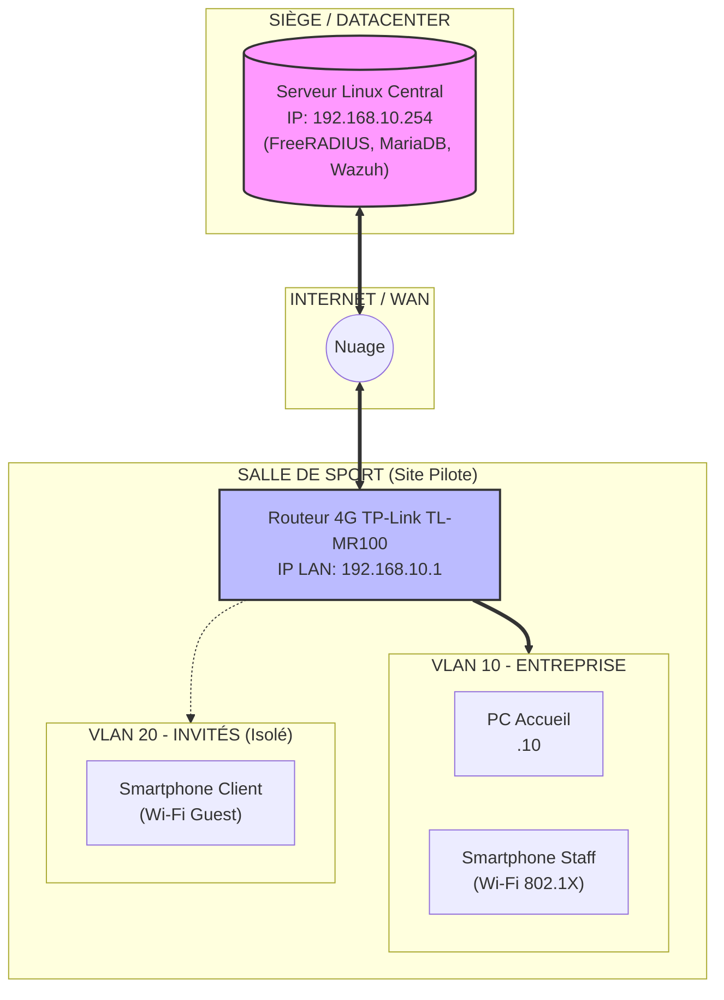
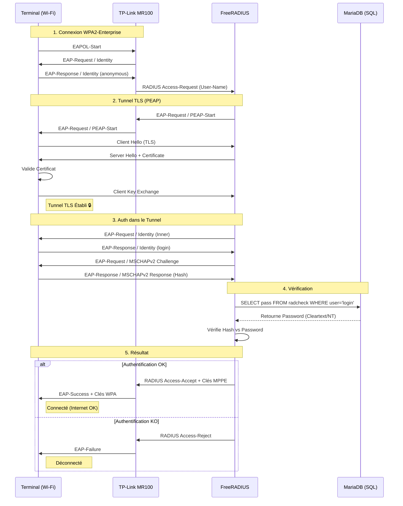

# Dossier d’architecture

## 1. Contexte et objectifs

Le projet s'inscrit dans le cadre de la modernisation de l'infrastructure réseau de la chaîne de salles de sport **"Fitness Plus"**. L'objectif principal est de passer d'une gestion artisanale et disparate à une **architecture centralisée, sécurisée et supervisée**.

Les objectifs spécifiques sont :
- **Homogénéisation Multi-sites :** Déployer une configuration standardisée sur tous les sites, gérée depuis un point central.
- **Sécurisation du Wi-Fi :** Remplacer les clés partagées (PSK) statiques par une authentification **WPA2-Enterprise (802.1X)** pour le personnel.
- **Isolation des Invités :** Fournir un accès Internet aux clients via un réseau strictement isolé du Système d'Information (SI).
- **Centralisation :** Héberger les services critiques (FreeRADIUS, MariaDB, Wazuh) sur un serveur Linux unique durci.

## 2. Périmètre technique

- **SSID « Entreprise » (WPA2-Enterprise) :** Sécurisé par **PEAP-MSCHAPv2** (Login/Mdp dans tunnel TLS).
- **SSID « Invités » (Isolé) :** Réseau ouvert ou WPA2-PSK avec isolation client (Client Isolation) et pare-feu.
- **Supervision Wazuh :** Centralisation des logs (Syslog routeur + Logs RADIUS) et détection d'intrusions.
- **Durcissement Linux :** Application des recommandations ANSSI (SSH clés, UFW, permissions).
- **Gestion centralisée des comptes RADIUS :** Interface PHP + MariaDB pour l'administration.

## 3. Topologie et adressage

### Schéma d'Architecture (Mermaid)

### Plan d'adressage (Site Pilote)

| Zone | Équipement | Interface | Adresse IP | Masque | Rôle |
| :--- | :--- | :--- | :--- | :--- | :--- |
| **Siège** | Serveur Linux | `eth0` | `192.168.10.254` | `/24` | Services centraux |
| **Salle** | Routeur MR100 | `LAN` | `192.168.10.1` | `/24` | Passerelle par défaut |
| **Salle** | Réseau Staff | `VLAN 10` | `192.168.10.0` | `/24` | Postes fixes et terminaux staff |
| **Salle** | Réseau Invités | `VLAN 20` | `192.168.20.0` | `/24` | Accès Internet visiteurs (Isolé) |

## 4. Chaîne d’authentification EAP (PEAP-MSCHAPv2)

L'authentification assure que les identifiants ne circulent jamais en clair.

### Diagramme de Séquence (Mermaid)

## 5. Analyse du routeur TL-MR100

- **Fonctionnalités invité / isolation :**
    - Isolation de niveau 2 (Client Isolation) activée par défaut sur le SSID Invité.
    - Option "Allow Guest to access my Local Network" désactivée impérativement.
    - Empêche l'accès au LAN (192.168.10.x) et au serveur central.
- **Limites et contraintes :**
    - Syslog en UDP non chiffré (risque d'interception).
    - Pas de VLAN Tagging flexible sur les ports Ethernet (difficile de séparer le trafic filaire).
    - Pare-feu basique (pas de règles DPI ou stateful avancées).
- **Impacts sur l’architecture :**
    - Nécessite un durcissement fort du serveur central (UFW) pour compenser la faiblesse du routeur.
    - L'isolation doit être validée par des tests d'intrusion (nmap) réguliers.

## 6. Architecture multi-sites

- **Identification des sites :** Utilisation du fichier `clients.conf` pour déclarer chaque routeur comme un client NAS unique (`client site_bordeaux { ipaddr=... secret=... }`).
- **Adressage unique :** Chaque futur site devra utiliser un sous-réseau LAN différent (ex: Site 2 en 192.168.11.0/24) pour éviter les conflits de routage VPN.
- **Base unique :** Les utilisateurs sont stockés une seule fois dans MariaDB et peuvent se connecter sur n'importe quel site (Roaming).

## 7. Choix de sécurité

- **PEAP-MSCHAPv2 :** Choisi pour sa compatibilité native avec Windows/Android/iOS sans nécessiter de déploiement de certificats clients (PKI lourde).
- **Segmentation VLAN :** Isolation stricte des flux Invités vs Entreprise.
- **SSH par clé (Hardening) :** Suppression des mots de passe pour l'administration serveur.
- **Wazuh :** Pour aller au-delà du simple log et détecter les attaques actives (brute force).

## 8. Points de vigilance et limitations

- **Certificat Auto-signé :** Avertissement de sécurité sur les postes clients à la première connexion.
- **Logs non chiffrés :** Le Syslog UDP transite en clair sur le réseau local.
- **Disponibilité :** Dépendance forte au serveur central (SPOF). Si le lien WAN coupe, plus d'auth Wi-Fi Entreprise.
